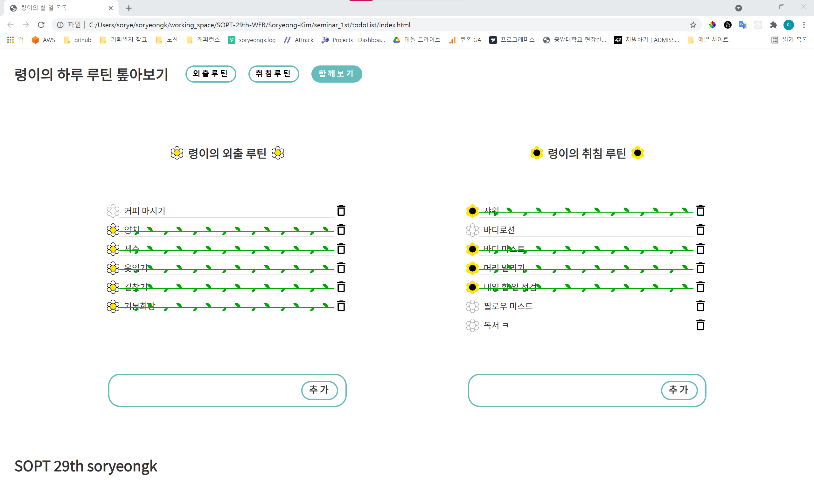
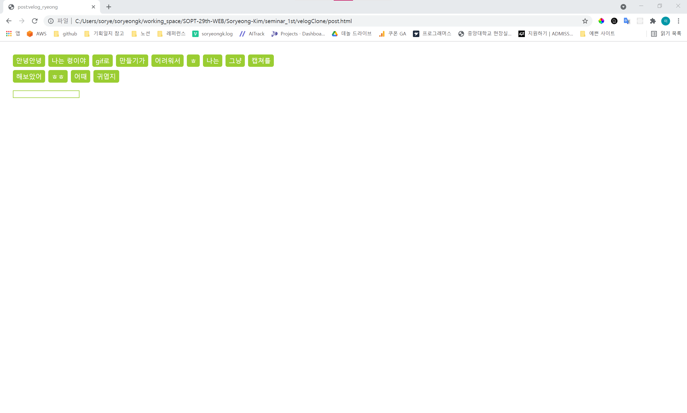

# Soryeong-Kim

## 0. 나만의 commit 규칙 with Emoji

|       commit type       |             Emoji              |     situation      |
| :---------------------: | :----------------------------: | :----------------: |
|          init           | :construction:`:construction:` |   작업 세팅 커밋   |
|          feat           |         :tada:`:tada:`         |     기능 추가      |
|           fix           |          :bug:`:bug:`          |     버그 수정      |
|           css           |    :nail_care:`:nail_care:`    |  css 스타일 수정   |
|          lint           |       :shirt: `:shirt:`        |   코드 lint 수정   |
|           doc           |         :memo:`:memo:`         |     문서 수정      |
|          clean          |        :truck:`:truck:`        | 폴더 및 파일 정리  |
|        refactor         |       :hammer:`:hammer:`       |      리팩토링      |
| Bad code / need improv. |       :hankey:`:hankey:`       | 개선이 필요한 코드 |
|   code review approve   |     :ok_hand:`:ok_hand:`​      |   코드 리뷰 수용   |

## 1. todo list 만들기

외출루틴과 취침루틴으로 나뉘어있고, 함께 보기(default)로 두 개를 한 번에 확인할 수 있다.

input에 내용을 입력하고 submit하면 내역이 추가된다. 외출과 취침 루틴에서의 꽃 색이 조금 다르다 ㅎ

이 내용들은 모두 localStorage에 저장되어 창을 껐다 켜도 이 상태가 유지된다.

일을 완료하고 난 후에 꽃 아이콘을 누르면 완료를 보여주는 줄기가 생성된다.

휴지통을 누르면 해당 내역이 사라진다.

## 2. velog 클론 코딩

velog by ryeong 부분은 다소 킹밧는 애니메이션으로 통통 튀게 해보았다.

`이번주` 옆 아이콘을 클릭하면 드롭다운 메뉴가 나오고, 이 부분은 `transition`과 `transform: scale()`로 애니메이션을 만들어보았다.

카드에 마우스를 올리면 위로 솟는 애니메이션이 나오고

카드를 클릭하면 모달창으로 더 크게 확인할 수 있게 하였다.

우측 상단 `새 글 작성`을 누르면 태그를 입력할 수 있는 화면이 나오는데 모습은 아래와 같다.

